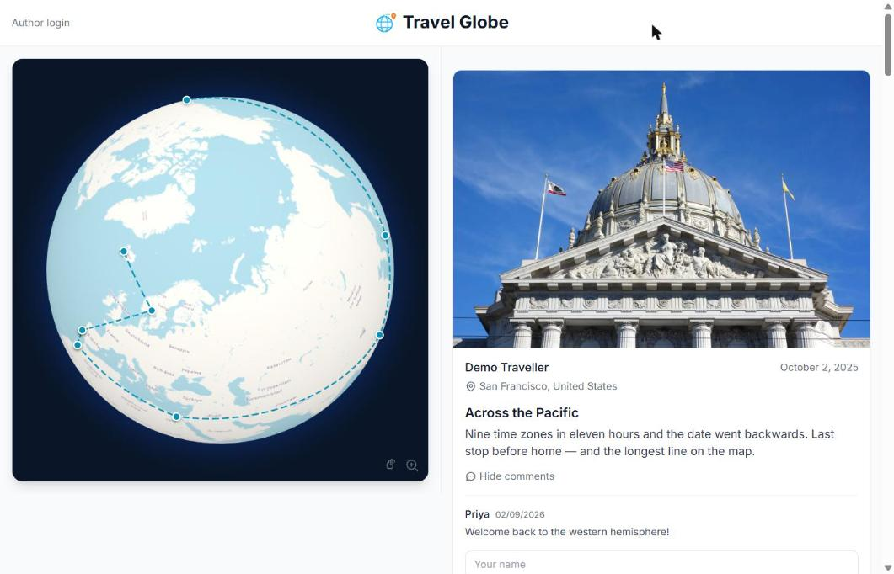
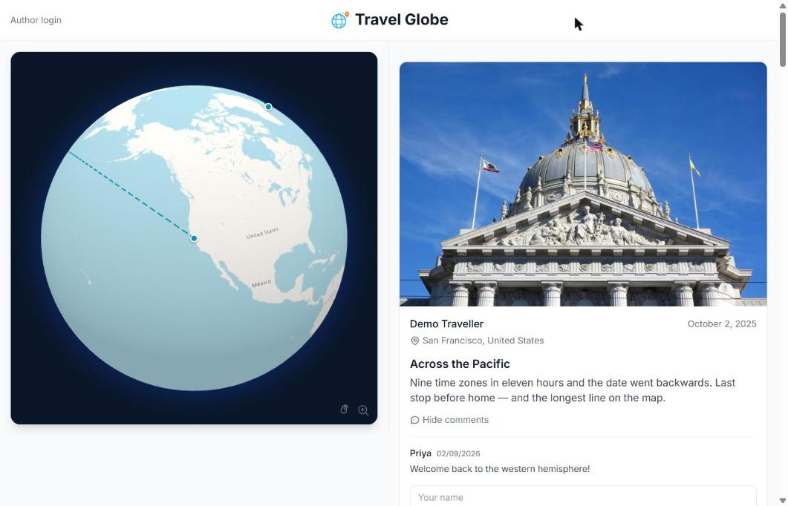
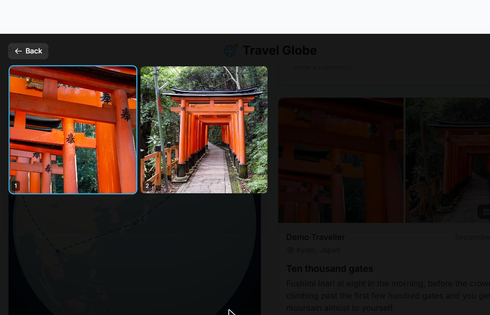
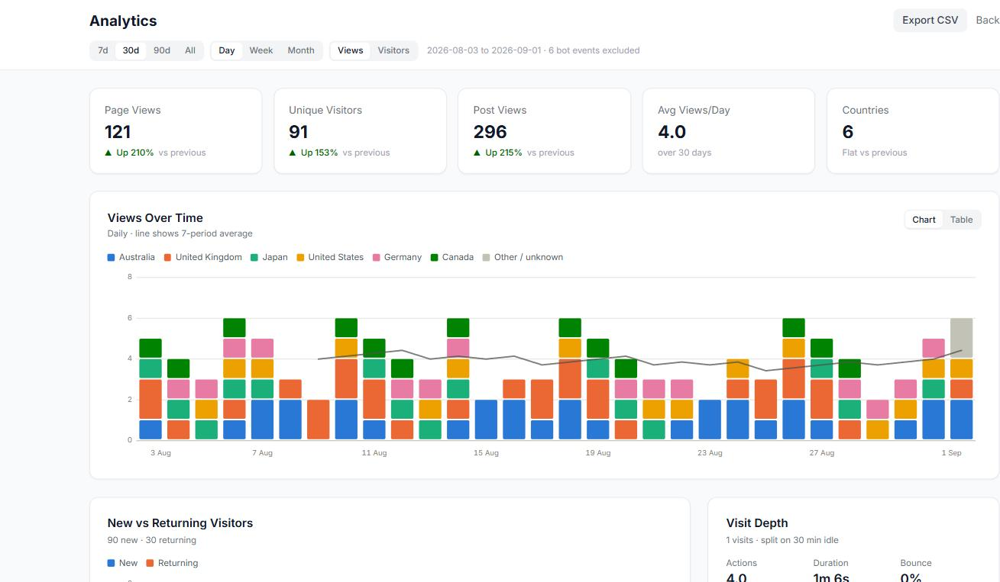
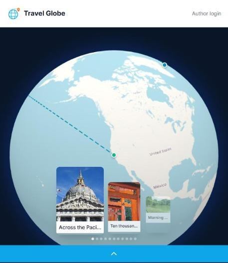

# Travel Globe

A self-hosted travel blog: Tumblr-style posts beside an interactive 3D globe that
draws your route as you go. Photos place themselves on the map from their own EXIF
GPS. Password-protected, so it is for friends and family rather than the open web.



## Try it in two minutes

```bash
git clone <repository-url> && cd travel-blog
cp .env.example .env

cd backend  && npm install && npm run seed
cd ../frontend && npm install

# terminal 1
cd backend && npm run dev
# terminal 2
cd frontend && npm run dev
```

Open <http://localhost:5173>.

| | |
|---|---|
| Viewer password | `demo1234` |
| Author login | `demo` / `demo1234` |

`npm run seed` builds a fictional round-the-world trip from the public domain
photographs in `backend/demo-assets/`, so the globe has a route to draw on first
run. It runs them through the real upload pipeline (EXIF read, resize, WebP
encode) rather than writing rows straight into the database, so what you see is
the app actually working. It refuses to run if the database already has posts.

## What it does

**An interactive globe.** Every located post becomes a pin, joined in
date order by a dashed route line. Click a pin to jump the feed to that post,
however far back it is: the feed opens at that post in a single request, with
newer posts above it and older ones below. Hover a post to spin the globe to it.



The route legs are **great circles**, interpolated as slerped unit vectors rather
than straight lines in lat/lng. That is what makes the Kyoto → San Francisco leg
above cross the Pacific instead of taking the 258° detour back across Asia. The
line is a custom `Line2` with `depthTest: false` and a clipping plane set at the
true horizon (`R²/d`, not the great circle through the centre), which keeps it a
constant 2px wide and stops it showing through the globe at any zoom.

**Photos carry their own location.** Drop in a photo and its EXIF GPS becomes the
pin; its capture date becomes the post date. HEIC is converted, everything is
resized to 2000px and re-encoded as WebP.

**Six post types:** photo/video, text, quote, link and audio, plus a lightbox
with a grid gallery mode, keyboard navigation and swipe gestures.



**Analytics that try to be honest.** Zero-filled date axes so quiet days stay
proportional, bot traffic flagged and excluded rather than deleted, visits
sessionised on a 30-minute idle gap because a 30-day cookie identifies a visitor
and not a visit, and a categorical palette checked for colour-vision deficiency
with a table view for the charts whose colours fall under 3:1 contrast.



**Mobile gets a map mode:** a full-screen globe with a swipeable carousel of
every located post. Tap a pin and the carousel turns to it.



## Making it yours

Nothing about the site's identity is in the source. Set it in `.env`:

```bash
VITE_SITE_NAME=Our Big Trip
VITE_SITE_TAGLINE=Enter the password to see where we are
SITE_DOMAIN=example.com
SITE_URL=https://example.com
```

For your own logo, drop a `logo.png` into `frontend/public/branding/`. That folder
is gitignored, so it survives every `git pull` and never ends up in a commit.

`VITE_*` values are inlined by Vite at build time, so changing them needs a
rebuild (`docker compose up --build`), not just a restart.

Then create your own accounts and replace the demo ones:

```bash
cd backend && npm run setup
```

## Deploying

```bash
cp .env.example .env     # set your secrets and domain
docker compose up --build -d
```

`docker-compose.yml` is a production stack: nginx terminating TLS on 443 with
certificates read from `/etc/letsencrypt`, and named volumes for the database and
uploads so they survive rebuilds.

To try the containers without certificates, or if TLS is terminated upstream:

```bash
docker compose -f docker-compose.local.yml up --build   # http://localhost
```

> Two things in `docker-compose.yml` are load-bearing. Switching `db-data` or
> `uploads` from named volumes to bind mounts points the backend at an empty
> directory and it will create a blank database. The site comes up with no posts
> or accounts, and the real data stays behind in the volume. Dropping port 443 or
> the letsencrypt mount breaks HTTPS.

Generate real secrets before going live:

```bash
openssl rand -base64 32   # SESSION_SECRET
openssl rand -base64 32   # CSRF_SECRET
```

## Stack

React 18 · TypeScript · Tailwind · Vite · Express · SQLite (sql.js) · Globe.gl
(Three.js) · sharp · exifr · Docker.

SQLite via sql.js means the whole database is one file and a backup is a file
copy. It also means the database lives **in memory** while the server runs and is
written back on change, so after any out-of-band change to the file (a restore,
a `npm run setup`), restart the backend or it will overwrite your change.

## Project layout

```
backend/
  src/
    db/           schema + sql.js wrapper
    middleware/   auth, rate limiting, validation, CSRF
    routes/       API endpoints
    services/     EXIF, geocoding, image processing, sanitiser
    seed.ts       demo data
  demo-assets/    public domain photos used by the seed
  scripts/        one-off asset preparation
frontend/
  src/
    components/   admin/ feed/ globe/ auth/
    lib/geo.ts    great-circle + horizon-clipping maths (pure, testable)
    config.ts     site branding from env
  nginx.conf.template       HTTPS server, ${SITE_DOMAIN} substituted at start
  nginx.http.conf.template  plain HTTP variant
  nginx-app.conf            shared server body
  scripts/        one-off asset preparation
docs/
  CREDITS.md      image provenance
scripts/
  check-public-safe.sh   pre-publish leak check
```

## API

All endpoints are under `/api`. Viewer routes need the shared password; author
routes need an account.

| Endpoint | Method | Auth | Description |
|---|---|---|---|
| `/viewer/login` | POST | none | Viewer password login |
| `/viewer/check` | GET | none | Session status |
| `/auth/login` `/auth/logout` `/auth/me` | POST/POST/GET | none/author/author | Author session |
| `/posts` | GET/POST | viewer/author | List (paginated, see below) / create |
| `/posts/:id` | GET/PUT/DELETE | viewer/author/author | Read / update / delete |
| `/posts/globe/data` | GET | viewer | Pins, route and map-mode carousel cards |
| `/comments/post/:postId` | GET/POST | viewer | Approved comments / submit |
| `/comments/pending` `/comments/all` | GET | author | Moderation queues |
| `/comments/:id` `/comments/:id/approve` | PUT/DELETE | author | Edit, delete, approve |
| `/upload` | POST | author | Upload media (200MB limit) |
| `/analytics/event` | POST | none | Track an event |
| `/analytics/summary` `/analytics/events` `/analytics/export` | GET | author | Reporting and CSV |
| `/settings/:key` | GET/PUT | author | `comment_moderation`, `rate_limiting_enabled` |
| `/geocoding/reverse` `/geocoding/search` | GET | author | Nominatim lookups |
| `/csrf-token` `/health` | GET | none | CSRF token, health check |

`GET /posts` returns posts newest first, `limit` at a time (default 10, max 50),
by `page=N` or by cursor, where the cursor is a post id: `at=<id>` gives that
post and older (how the feed opens at a clicked pin), `before=<id>` older posts,
`after=<id>` newer ones. Every response says whether more exist either way
(`hasOlder`, `hasNewer`).

## Security

CSRF double-submit cookies · configurable rate limiting · `express-validator` on
all input · DOMPurify on user content · HttpOnly SameSite session cookies ·
Helmet · ownership checks on edit and delete · bcrypt password hashing.

The viewer password is the only thing between the public and the photos, so make
it a real one.

## Configuration

| Variable | Description | Default |
|---|---|---|
| `VITE_SITE_NAME` | Site name in the header, gate and tab title | `Travel Globe` |
| `VITE_SITE_TAGLINE` | Line under the name on the viewer gate | `Enter the password to continue` |
| `VITE_SITE_DESCRIPTION` | HTML meta description | see `.env.example` |
| `SITE_DOMAIN` | Domain nginx serves and finds certificates for | `localhost` |
| `SITE_URL` | Public URL, sent to Nominatim as required by its policy | `http://localhost:5173` |
| `SITE_NAME` | Application name for the Nominatim User-Agent | `Travel Globe` |
| `PORT` | Backend port | `3001` |
| `NODE_ENV` | Environment | `development` |
| `FRONTEND_URL` | CORS origin | `http://localhost:5173` |
| `SESSION_SECRET` | Session signing key | **change it** |
| `CSRF_SECRET` | CSRF signing key | **change it** |

## Credits

Demo photographs are public domain or CC0 works by other photographers.
See [docs/CREDITS.md](docs/CREDITS.md) for each one's source and licence.

## Licence

MIT. See [LICENSE](LICENSE).
